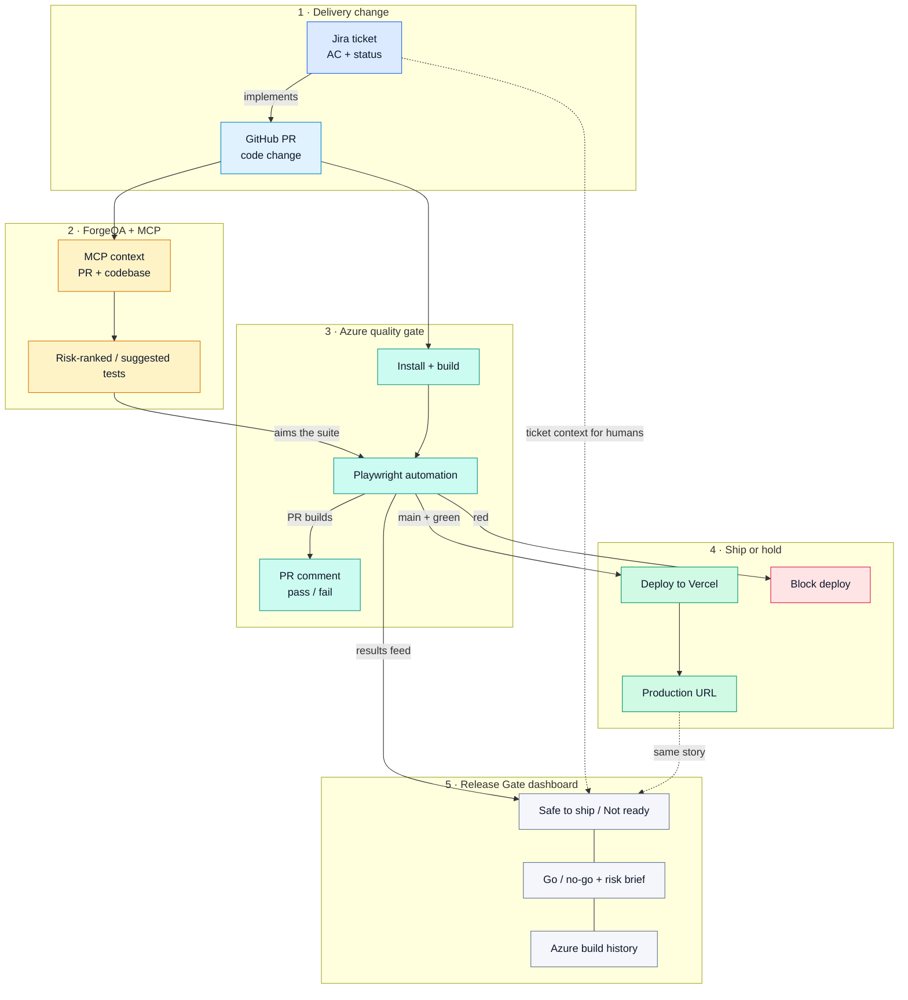
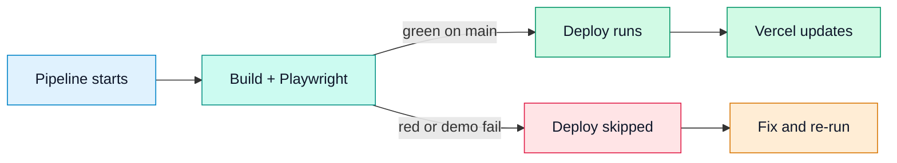

# Release Gate Lab

A **Release Gate dashboard** plus a **lean Azure Pipeline** that only deploys to Vercel when a small Playwright smoke suite passes.

**Live demo:** https://release-gate-lab.vercel.app/

## Why this exists

Large test suites that nobody reviews become theater. This lab shows the opposite:

- A **tiny, trusted Playwright suite** (quality gate, not a bottleneck)
- **Human go/no-go** next to automation (checklist + auto risk brief)
- **Deploy only on pass** — and a safe way to demo the failure path

## Architecture idea

This lab is the **result board** for a bigger delivery loop. The full shape looks like this:

| Piece | Role |
|-------|------|
| **Jira** | System of record for the delivery ticket, acceptance criteria, and status humans trust |
| **GitHub PR** | The code change that implements that ticket |
| **ForgeQA + MCP** | AI layer that connects PR / codebase context to risk-ranked or suggested tests (what should run for *this* change) |
| **Azure + Playwright** | Lean quality gate that actually runs and decides ship vs hold |
| **This dashboard** | Where release owners read the **outcome** of that gate |

So the point is not “another CI badge.” It’s:

**Jira ticket → PR → ForgeQA/MCP (what to verify) → Azure/Playwright (run the gate) → Release Gate dashboard (did we clear to ship?)**

This repo ships the **dashboard + Azure deploy gate** slice end to end. Jira and ForgeQA/MCP are first-class in the architecture story — the upstream context that makes the board meaningful — even when they live in sibling projects or a next integration step.

## What the dashboard is for

The dashboard is the **end board for the gate** — not another place to write tests.

When work starts from a **Jira ticket**, a developer opens a **GitHub PR**. ForgeQA/MCP helps aim verification at the right risk for that change. Azure runs the lean Playwright suite. The pipeline already decides pass/fail and whether deploy is allowed. The dashboard is where a release owner **reads the outcome**:

- Did Playwright automation pass on the latest Azure build?
- Is the human checklist complete?
- What risk signal should a developer review (especially on failures)?
- What do recent Azure builds show?

## System flow



### Happy path vs gate hold



## What’s in the dashboard

1. **Gate status** — Safe to ship / Not ready, with Playwright + deploy + checklist signals  
2. **Go / no-go checklist** — required human checks next to automation  
3. **Risk note** — auto brief for developers (failures → KPI-oriented review; open human gate → process hold)  
4. **Recent Azure builds** — live when configured; demo history otherwise  

## Stack

| Layer | Choice |
|-------|--------|
| App | Vite + React + TypeScript |
| Smokes | Playwright (lean suite) |
| CI | Azure Pipelines |
| Host + API | Vercel (`/api/runs` proxies Azure) |
| Architecture partners | Jira (ticket system of record), ForgeQA + MCP (test intelligence) |

## Quick start

**Prerequisites:** Node.js 20+

```bash
npm install
npm run dev
```

Open the URL Vite prints (usually `http://localhost:5173`).

```bash
npm run build
npx playwright install chromium
npm run test:smoke
```

## Docs

| Doc | What |
|-----|------|
| [docs/AZURE_VERCEL_SETUP.md](docs/AZURE_VERCEL_SETUP.md) | Connect Azure → Vercel secrets |
| [docs/PHASE4_AND_DEMOS.md](docs/PHASE4_AND_DEMOS.md) | Live Azure board, PR comments, failure-path demo |

## Pipeline behavior

```text
Jira ticket → GitHub PR
  → ForgeQA / MCP aims verification for this change
  → Azure: install + build
  → Playwright automation
      (optional: FORCE SMOKE FAIL demo toggle)
  → PR builds: comment pass/fail on GitHub
  → main + green → deploy Vercel
  → red → block deploy
  → dashboard shows the gate outcome for humans
```

## What this intentionally skips

- No 100+ test suite  
- No Mac Mini / device farm  
- No giant pre-prod matrix that slows every PR  

## Privacy

Do not commit `.env`, Vercel tokens, Azure PATs, or GitHub tokens.
