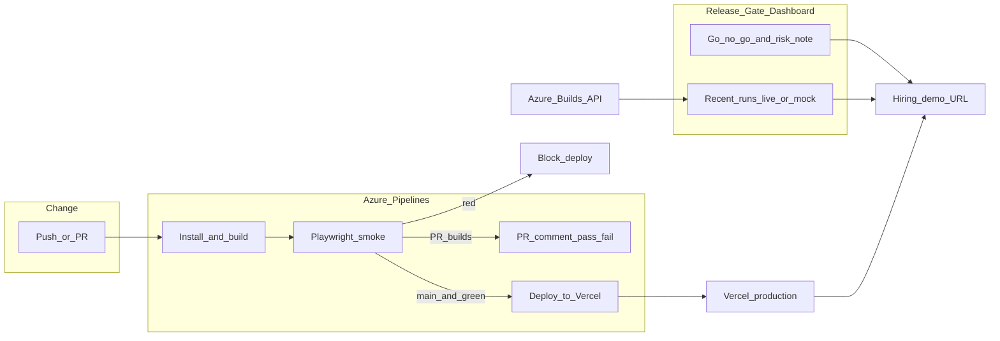
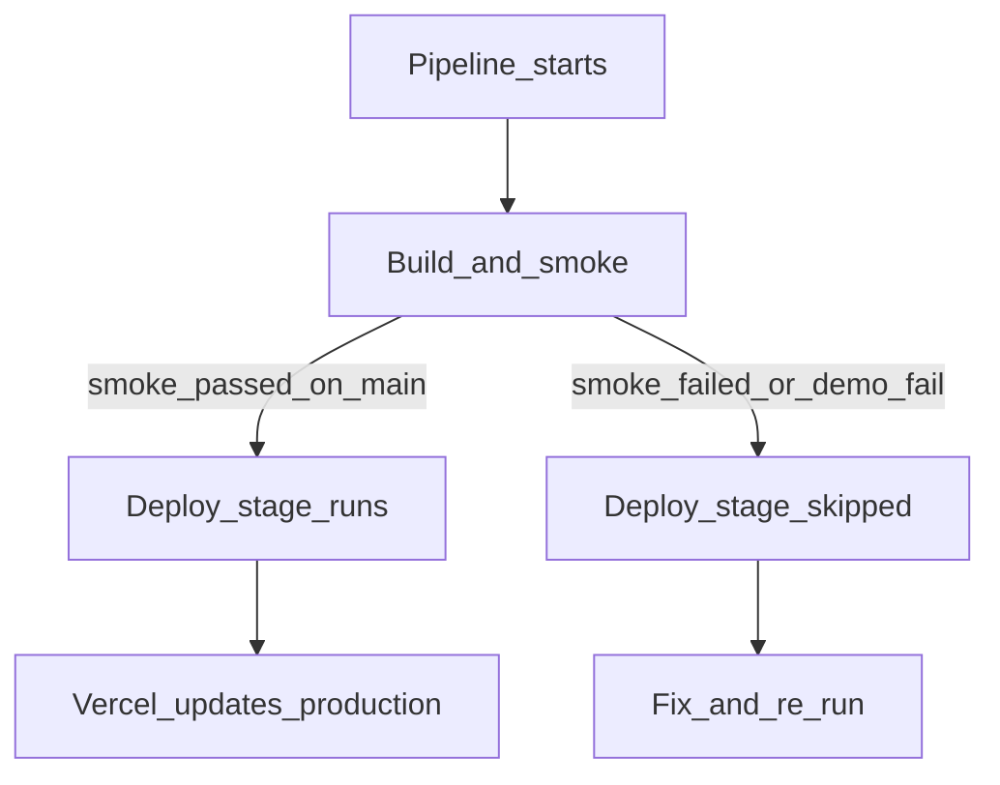

# Release Gate Lab

A portfolio project: a **Release Gate dashboard** plus a **lean Azure Pipeline** that only deploys to Vercel when a small Playwright smoke suite passes.

**Live demo:** https://release-gate-lab.vercel.app/

**Interview one-liner:** “I built a Release Gate dashboard and an Azure pipeline that only deploys when a small, reviewable smoke suite passes — quality as a gate, not a bottleneck.”

## Why this exists

Large test suites that nobody reviews become theater. This lab shows the opposite:

- A **tiny, trusted smoke suite** (quality gate, not a bottleneck)
- **Human go/no-go** next to automation (checklist + risk note)
- **Deploy only on pass** — and a safe way to demo the failure path

## System flow



### Happy path vs gate hold



## What’s in the dashboard

1. **Release health hero** — Safe to ship / Not ready, plus latest run status  
2. **Go / no-go checklist** — Required human checks next to automation  
3. **Risk note** — short “why this release is risky / not”  
4. **Recent runs** — live Azure when configured; mock fallback otherwise  

## Stack

| Layer | Choice |
|-------|--------|
| App | Vite + React + TypeScript |
| Smokes | Playwright (lean suite) |
| CI | Azure Pipelines |
| Host + API | Vercel (`/api/runs` proxies Azure) |

## Quick start

**Prerequisites:** Node.js 20+

```bash
npm install
npm run dev
```

Open the URL Vite prints (usually `http://localhost:5173`).

```bash
npm run build
npx playwright install chromium
npm run test:smoke
```

## Docs

| Doc | What |
|-----|------|
| [docs/AZURE_VERCEL_SETUP.md](docs/AZURE_VERCEL_SETUP.md) | Connect Azure → Vercel secrets |
| [docs/PHASE4_AND_DEMOS.md](docs/PHASE4_AND_DEMOS.md) | Live Azure board, PR comments, failure-path demo |

## Pipeline behavior

```text
Push / PR
  → Azure: install + build
  → Playwright smoke
      (optional: FORCE SMOKE FAIL demo toggle)
  → PR builds: comment pass/fail on GitHub
  → main + green → deploy Vercel
  → red → block deploy
```

## What this intentionally skips

- No 100+ test suite  
- No Mac Mini / device farm  
- No giant pre-prod matrix that slows every PR  

## Privacy

Do not commit `.env`, Vercel tokens, Azure PATs, or GitHub tokens.
